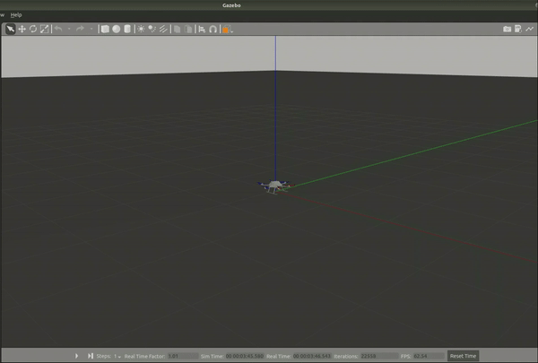

# RotorS Gym Experimental Framework

RotorS Gym is a framework dedicated for robotics researchers for designing reinforcement learning-based controllers. 
It combines the following toolkits:

* [OpenAI Gym](https://github.com/openai/gym)
* [gym-gazebo](https://github.com/erlerobot/gym-gazebo)
* [RotorS MAV](https://github.com/ethz-asl/rotors_simulator)

## Requirements

* Ubuntu 16.04 LTS
* ROS Kinetic 
* gym-gazebo
* pytorch 1.0.1

## Instruction

#### Launch Gazebo

With GUI
    
    roslaunch rotors_gazebo mav.launch mav_name:=firefly world_name:=basic

Headless:
    
    roslaunch rotors_gazebo mav.launch mav_name:=firefly world_name:=basic gui:=false headless:=true

### Launch Model

Train the agents:

    python train.py

Play the demo:

    python demo.py

 

## Publication

* [Deep Reinforcement Learning-based Continuous Control for Multicopter Systems.](https://orbilu.uni.lu/handle/10993/41999)

## References

* [OpenAI Gym](https://github.com/openai/gym)
* [gym-gazebo](https://github.com/erlerobot/gym-gazebo)
* [RotorS MAV](https://github.com/ethz-asl/rotors_simulator)
* [TianhongDai](https://github.com/TianhongDai/reinforcement-learning-algorithms/tree/master/rl_algorithms/trpo)
